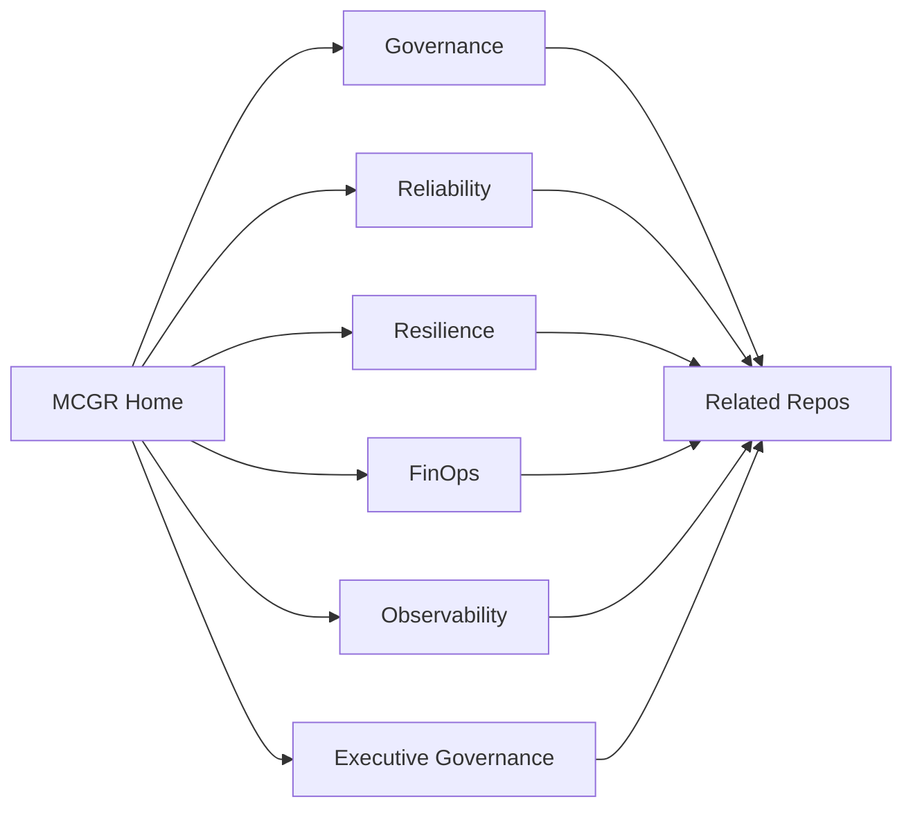

# MCGR Framework  
## Multi-Cloud Governance and Site Reliability Engineering Framework

## Overview

The MCGR Framework is a research-driven enterprise architecture framework for governing, operating, and optimizing multi-cloud platforms across AWS, Azure, GCP, and hybrid cloud environments.

It integrates cloud governance, Site Reliability Engineering, FinOps, disaster recovery, observability, compliance alignment, and executive technology governance into a unified operating model.
It should also make the ecosystem easy to explain from the public homepage and from the supporting repo pages.

## Downloadable Enterprise Starter Kit

A runnable, dependency-free baseline assessor is available in [`starter-kit/mcgr-enterprise-starter-kit`](starter-kit/mcgr-enterprise-starter-kit). It helps enterprises inventory AWS, Azure, GCP, and hybrid environments, score coverage across the six MCGR operating dimensions, and produce a JSON remediation report.

```bash
cd starter-kit/mcgr-enterprise-starter-kit
npm run assess
npm test
```

For a direct download, use the **Download enterprise starter kit** button on the framework homepage, which serves `public/downloads/mcgr-enterprise-starter-kit.zip`.

## Purpose

Modern enterprises often manage fragmented cloud platforms, inconsistent governance, disconnected observability, rising cloud costs, and uneven disaster recovery maturity.

The MCGR Framework addresses these challenges by providing a structured model for:

- Multi-cloud governance
- Site Reliability Engineering
- FinOps cost optimization
- Disaster recovery readiness
- Observability and operational intelligence
- Architecture governance
- Compliance and risk alignment
- Executive decision-making

## Framework Layers

1. **Governance Layer**  
   Architecture standards, policy controls, ARB integration, and risk ownership.

2. **Reliability Layer**  
   SLOs, SLIs, error budgets, incident response, and reliability scorecards.

3. **Resilience Layer**  
   Disaster recovery readiness, RTO/RPO governance, failover planning, and recovery validation.

4. **FinOps Layer**  
   Cost visibility, rightsizing, cloud financial governance, and executive cost reporting.

5. **Observability Layer**  
   Monitoring, telemetry, dashboards, anomaly detection, and operational intelligence.

6. **Compliance Layer**  
   Security controls, regulatory alignment, audit readiness, and Zero Trust principles.

7. **Executive Governance Layer**  
   Capability maturity, risk reporting, transformation roadmaps, and business-technology alignment.

## Research Context

This repository supports the public research paper:

**A Multi-Cloud Governance and Site Reliability Engineering Framework for FinTech Platforms: A Case Study**  
SSRN: https://papers.ssrn.com/abstract=6663578

Related research themes include:

- Multi-cloud governance
- SRE maturity
- FinOps governance
- Disaster recovery readiness
- AI-driven observability
- Policy drift detection
- Enterprise resilience maturity

## Ecosystem Map

### Core Frameworks

- [Multi-Cloud Governance Model](../multi-cloud-governance-model/README.md)
- [SLO-Driven Cloud Architecture](../slo-driven-cloud-architecture/README.md)
- [Cloud FinOps Governance](../cloud-finops-governance/README.md)
- [DR Governance Framework](../dr-governance-framework/README.md)
- [AI-Driven Observability Framework](../ai-driven-observability-framework/README.md)
- [Cloud Risk and Compliance Controls](../cloud-risk-compliance-controls/README.md)
- [AI Governance Framework](../ai-governance-framework/README.md)

## Quick View

| Layer | Core Focus | Supporting Repos |
| --- | --- | --- |
| Governance | Standards, policy, control ownership | Multi-Cloud Governance Model, Cloud Risk and Compliance Controls |
| Reliability | SLOs, error budgets, incident response | SLO-Driven Cloud Architecture, SRE Reliability Models |
| Resilience | DR readiness and failover | DR Governance Framework, Enterprise Resilience Maturity Model |
| FinOps | Cost visibility and optimization | Cloud FinOps Governance, Cloud Governance Assessment Toolkit |
| Observability | Telemetry and prediction | AI-Driven Observability Framework, Predictive Reliability Models |
| Executive | Roadmaps and decision support | Executive Technology Roadmaps, Cloud Transformation Case Studies |

### Applied Operating Repos

- [Cloud Governance Assessment Toolkit](../cloud-governance-assessment-toolkit/README.md)
- [Enterprise Resilience Maturity Model](../enterprise-resilience-maturity-model/README.md)
- [Technical Due Diligence Cloud](../technical-due-diligence-cloud/README.md)
- [Platform Engineering Operating Model](../platform-engineering-operating-model/README.md)
- [Executive Technology Roadmaps](../executive-technology-roadmaps/README.md)

### Supporting Knowledge Repos

- [Architecture Diagrams](../architecture-diagrams/README.md)
- [Cloud Transformation Case Studies](../cloud-transformation-case-studies/README.md)
- [Enterprise Architecture Blueprints](../enterprise-architecture-blueprints/README.md)
- [Papers and Publications](../papers-and-publications/README.md)
- [Predictive Reliability Models](../predictive-reliability-models/README.md)
- [Self-Healing Cloud Operations](../self-healing-cloud-operations/README.md)
- [SRE Reliability Models](../sre-reliability-models/README.md)

## Related Repositories

- Multi-Cloud Governance Model  
  https://github.com/rammar876/multi-cloud-governance-model

- SLO-Driven Cloud Architecture  
  https://github.com/rammar876/slo-driven-cloud-architecture

- DR Governance Framework  
  https://github.com/rammar876/dr-governance-framework

- Cloud FinOps Governance  
  https://github.com/rammar876/cloud-finops-governance

- AI-Driven Observability Framework  
  https://github.com/rammar876/ai-driven-observability-framework

- Enterprise Resilience Maturity Model  
  https://github.com/rammar876/enterprise-resilience-maturity-model

- AI Governance Framework  
  https://github.com/rammar876/ai-governance-framework

- Enterprise Architecture Blueprints  
  https://github.com/rammar876/enterprise-architecture-blueprints

- Predictive Reliability Models  
  https://github.com/rammar876/predictive-reliability-models

- Self-Healing Cloud Operations  
  https://github.com/rammar876/self-healing-cloud-operations

- SRE Reliability Models  
  https://github.com/rammar876/sre-reliability-models

## Repository Structure

```text
docs/                    Core framework documentation
governance-models/       Governance and ARB operating models
maturity-model/          MCGR maturity levels and capability model
models/                  Reliability, cost, drift, and resilience models
templates/               Reusable governance and assessment templates
scorecards/              MCGR and SRE maturity scorecards
dashboards/              Executive dashboard examples
diagrams/                Architecture and framework visuals
implementation-roadmap/  Adoption roadmap and implementation plan
evidence/                Impact metrics and research evidence
publications/            SSRN and conference mapping
references/              Bibliography and supporting references
use-cases/               Enterprise and FinTech use cases

```

## Start Here

- [Content Index](docs/content-index.md)
- [Operating Model Index](docs/operating-model-index.md)
- [Shared Starter Kit](docs/shared-starter-kit.md)
- [Content Playbook](docs/content-playbook.md)
- [Framework Overview](docs/framework-overview.md)
- [Framework Architecture](docs/framework-architecture.md)

## Recommended Build Path

1. Read the content index.
2. Use the playbook to keep section structure consistent.
3. Expand the core framework pages first.
4. Reuse the same pattern in the related repositories.

## Ecosystem Flow


