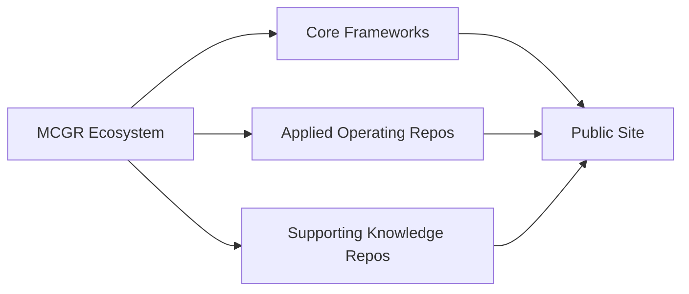

# MCGR Ecosystem Page Draft

## Purpose

This page presents the participating repositories as a connected ecosystem under the MCGR umbrella.

## Core Frameworks

- [Multi-Cloud Governance Model](../multi-cloud-governance-model/README.md)
- [SLO-Driven Cloud Architecture](../slo-driven-cloud-architecture/README.md)
- [Cloud FinOps Governance](../cloud-finops-governance/README.md)
- [DR Governance Framework](../dr-governance-framework/README.md)
- [AI-Driven Observability Framework](../ai-driven-observability-framework/README.md)
- [Cloud Risk and Compliance Controls](../cloud-risk-compliance-controls/README.md)
- [AI Governance Framework](../ai-governance-framework/README.md)

## Applied Operating Repos

- [Cloud Governance Assessment Toolkit](../cloud-governance-assessment-toolkit/README.md)
- [Enterprise Resilience Maturity Model](../enterprise-resilience-maturity-model/README.md)
- [Technical Due Diligence Cloud](../technical-due-diligence-cloud/README.md)
- [Platform Engineering Operating Model](../platform-engineering-operating-model/README.md)
- [Executive Technology Roadmaps](../executive-technology-roadmaps/README.md)

## Supporting Knowledge Repos

- [Architecture Diagrams](../architecture-diagrams/README.md)
- [Cloud Transformation Case Studies](../cloud-transformation-case-studies/README.md)
- [Enterprise Architecture Blueprints](../enterprise-architecture-blueprints/README.md)
- [Papers and Publications](../papers-and-publications/README.md)
- [Predictive Reliability Models](../predictive-reliability-models/README.md)
- [Self-Healing Cloud Operations](../self-healing-cloud-operations/README.md)
- [SRE Reliability Models](../sre-reliability-models/README.md)

## How To Use This Page

Use this page to help visitors understand:

- where to begin
- which repo matches their need
- how the ecosystem is organized
- which supporting assets are available

## Ecosystem Table

| Repo Group | Best For | Notes |
| --- | --- | --- |
| Core Frameworks | Governance and operating models | Anchor the flagship story |
| Applied Operating Repos | Assessment and execution | Turn the framework into practice |
| Supporting Knowledge Repos | Diagrams, cases, and publications | Provide proof and reusable visuals |

## Figure

